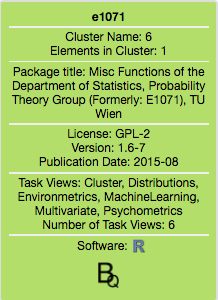

# BitQuery VA-App - Tooltip

A tooltip component for BitQuery VA-App: *details-on-demand*. 
Shows detailed information on chosen data node, e.g. package title, version etc.

## License

Apache License 2.0
